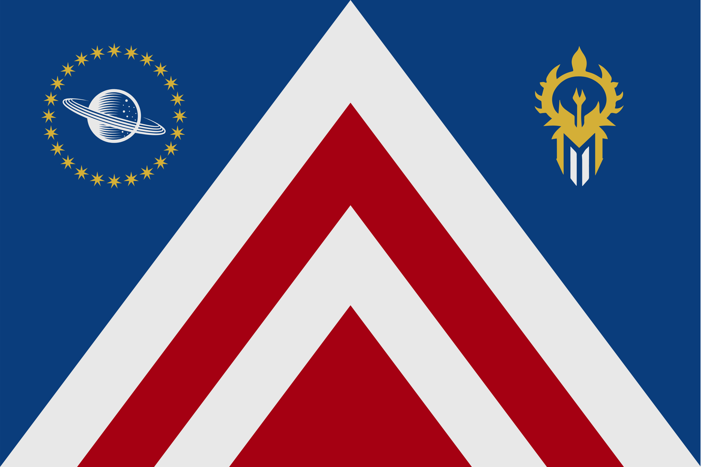
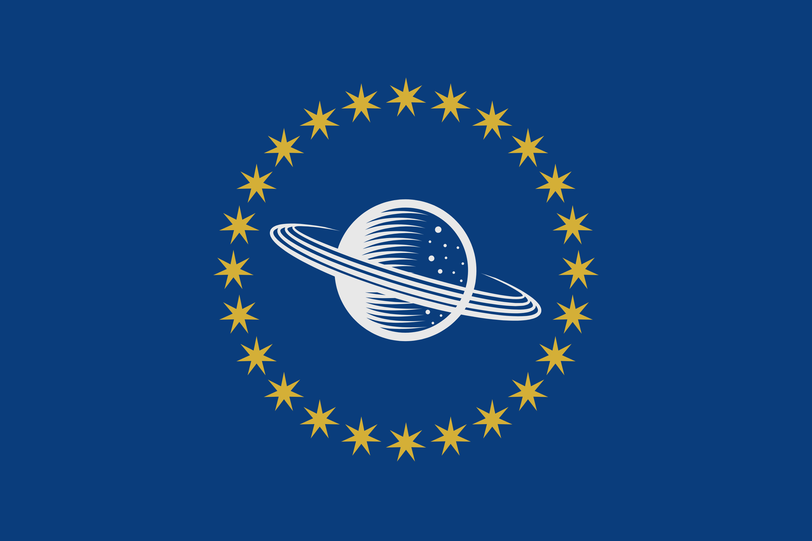
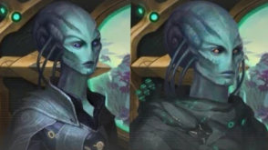

# Cyroni Commonwealth
## Flags

Red represents the passion, expression and curiosity of the people. Blue represents the exploration of Space. White represents the Cyronian’s dedication to peace. The arrow represents the Cyroni’ passion driving them towards space and their goal of peace and ascension to the caretakers of the galaxy. The planet represents their old homeworld; Cy’rie, which was never forgotten by the Cyroni. The 24 Stars represent the 24 Provinces which make up the Commonwealth. Each star has 7 points, representing the 7 Districts that make up a Province. The symbol on the right is an ancient Cyronian primitive blade, representing their military prowess and fascination by history.

## Info
The Cyroni are an interventionist, moral, and emotional based culture. Leaders who have the title of ‘caretaker’ are elected based on wisdom, knowledge, ability and determination. Caretakers administer their appointed sector (sectors are made up of 7 provinces) of the Commonwealth. No caretaker is above another. Citizens prioritise others above themselves and generally dictate their lives for the greater good. Crime is practically non-existent. Some cultures abhor the Cyroni because of their interventionism and do not operate on the same moral code. Some extreme members of this culture will resort to any means for the greater good, sometimes temporarily putting aside their moral code to the displeasure of others. 

## Style
### Features
Sleek, Symmetric, Modern-Futuristic.

### Primary Colours
Black, Blue, White, Dark Red.

## Reference Images:

## History
The Cyroni originate from their homeworld of Cy’rie, slightly smaller than Earth. The planet featured rocky rings with a few shepherd moons. A moon (roughly the size of Enceladus) orbited the planet. At some point, an undetected, small black hole entered the system and threw everything off balance, causing Cy’rie to be thrown into its parent star. The Curators noticed this upset (as they kept tabs on known sapient species) and enacted an emergency procedure to relocate the Cyroni to the Ark (a large habitable gigastructure intended to preserve species). The Cyroni were allowed to rebuild on the Ark with minimal interference from the Curators. The Curators would subtly introduce their moral code to the Cyroni over time. One day the curators stopped appearing and the Cyroni never knew why. 