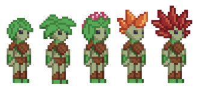

# Floran Domain
Florans do not have a flag.

## Info
The Florans are a unique oddity among the galaxy. They are a plantoid bipedal race and are extremely primitive compared to other space-faring sapient species, but they’ve got the knack for just about anything tech. Their space is not as much an empire as it is a chaotic mess of hundreds of tribes, each lead by their respective Greenfinger. There is no centralised authority or unity among the Florans. Because of this, other empires refer to their space as “The Domain”, however the Ottokaarans refer to their space as “The Outback”. Florans love to steal and reverse-engineer technology from their neighbours, however this rarely ends well for them. The only other empire they can consistently raid technology from are the Zilkar States / Eir Confederation as the current government does not care much about the violation of their borders. Basically, they’re space pirates.

## Style
### Features
A conglomerated mess of other empires’ tech

### Primary Colours
Green, Brown, Black, Red, Orange, Yellow

# Reference Images
