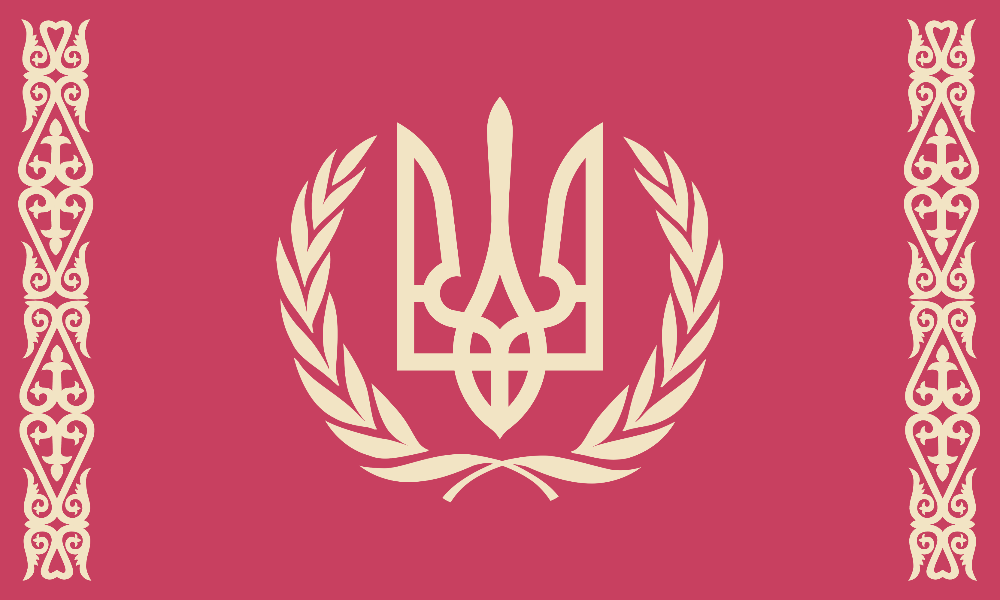

# Lu'So Empire
## Flag

## Info
The Lu’So are a cunning warrior species, their empire grows as they conquer the worlds of smaller empires. Their empire is ruled by 12 families. As they ran out of worlds to conquer, the 12 families began to turn on each other, trying to achieve the smallest, pettiest victory. One of the families even tried to pick a fight with the neighbouring Ottokaarans which did not end well. The Niox saw the Lu’So as childish, but nevertheless extremely annoying. Thus, they deployed Antimatter Mines along their shared border which would hide in the interdimensional boundary between realspace and VEIL to avoid detection. These mines can target ships in realspace and VEIL.

## Style
### Features
**TODO**

### Primary Colours
Purple, White, Gray

## Reference Images
**TODO**