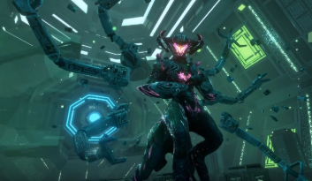

# Niox Dominion

## Info
The Niox are a materialist synthoid species, blurring the known lines between organic and synthetic. Homeworld is entirely machine and split into different layers orbiting the core. The Niox are individualistic, their political structure culminates in the Nexus; a forum where each voice contributes to the benefit of the empire. 

## Style
### Features
Blocky, Large, Lots of Sharp Angles (think the Architects from Subnautica)

### Primary Colours
Black, Green, Blue, Purple

## Reference Images

## History
While the Niox believe they were created by the Curators, in reality their species had hit a genetic collapse due to decades of poor augmentation and genetic modification. The Curators rescued the Niox from certain doom by upgrading organic components and using their most advanced technology to blur the lines between organic and machine. Unfortunately this detail was lost to time and the legend of the Niox being created by the Curators is leveraged over other empires to claim Curator tech.