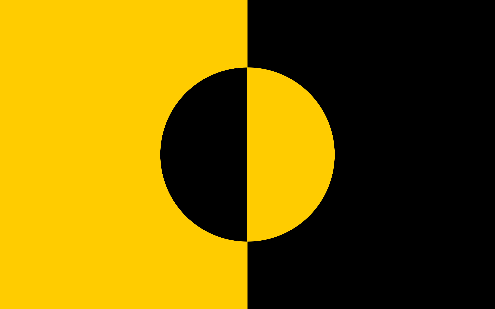
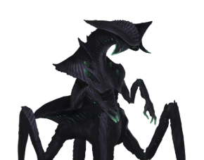

# Optok Hive
## Flag

Black represents Night, Yellow represents Day. The circle in the centre represents the Optok’s homeworld with Day and Night being flipped to represent how they are a uniquely nocturnal sapient species.

## Info
A nocturnal insectoid race living in the outer rim of the galaxy. They are a hive mind, not in the sense of a collective-consciousness, but a collective-instinct. They technically have individuality, but each ‘citizen’ works for the benefit of the species like bees. They are ruled by one Queen and are one of the weeker empires on the galactic stage, but still a formidable force.

## Style
### Features
**TODO**

### Primary Colours
Black, Gray, Yellow, Red

## Reference Images
