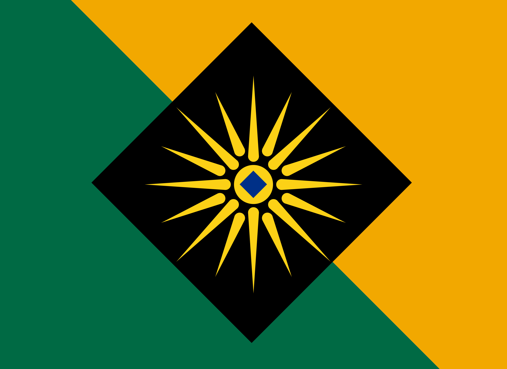
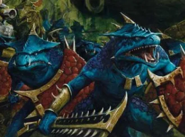
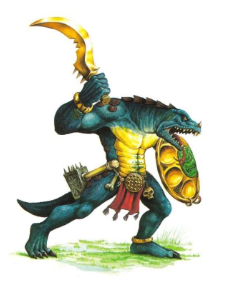

# Arch of Ottokaara
## Flag

Green represents the famous Ottokaaran jade-like stone which is unique to [Ottokaara](../../Locations/ottokaara.md) and a highly sought commodity. Many collectors travel to Ottokaara in hopes of attaining one of these stones. Gold represents the prosperity of Ottokaara and the high standard of living. Black represents the power and strength of the Ottokaaran empire. The sun represents Okaara; the central K Class Star in the Ottokaaran system. The sun is a reminder of Home for every Ottokaaran, wherever they see their flag, they are always reminded of home and what they fight and work for. The blue gemstone in the centre represents every Ottokaaran’s pledge of loyalty to the Archon. 

## Info
The Ottokaarans are a reptilian bipedal race specializing in mining, salvaging and war. Their homeworld is mostly arid and rocky with some small open deserts and pockets of agriculture. They are lead by their Archon as an absolute monarch. The Archon elects councils to manage his empire. His palace features in the centre of the capital, a large pyramidal structure constructed with gemstones of many colours embedded in the exterior walls. Ottokaara orbits a binary star system, the planet has expansive rocky rings which are harvested for construction and mining.

## Style
### Features
Spherical Jellyfish-Like Ships. Their buildings are pyramidal structures.

### Primary Colours
Gold, Black, Dark Turquoise, Brown

## Reference Images

## History
The Ottokaarans are comprised of two variants: Archons and Sperons. The latter being the most common and inferior variant. In their history, Archons acted as the Chieftans and leaders of tribes. Unfortunately, the gene is recessive, meaning it slowly died out. Only the Royal Family and select Leadership have the gene, making it rare.

Archons are Blue/Turqoise and have Gold scales, while Sperons are Grey and have Brown scales. Both have red, lizard-like eyes.