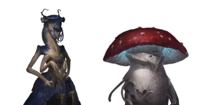

# Zilkar States / Eir Confederation
## Flags

## Info
The planet Zilkar is a rare case where two sapient species co-exist, originating from the same world. The two species feature: 1) the Zilkar, a hexapedal insectoid race towering at about 7ft on average, and 2) the Eir, a fungoid race. Whilst they agreed to live in harmony, a series of unfortunate liberal migration treaties with outside empires slowly lead to the Zilkar becoming a minority in their republic. The Eir who severely outnumbered the Zilkar by this point, seized the opportunity to take full control of their homeworld, banishing the Zilkar from the planet and renaming the planet to ‘Eir’. They were allowed to remain in the republic, but those who didn’t migrate now suffer extreme poverty and live under a poor standard of living. The republic is now a chaotic mess of migrants from all over the galaxy, the Eir have no intention of providing for them, only the wealthy who have links to influential powers in other empires. Some Zilkar formed rebel cells and are actively fighting against Eir control, planning to one day reclaim their homeworld. They source weapons and supplies from eager Floran tribes, trading technologies for their weapons. 

It should be noted the [Cyroni](../Cyronia/cyroni.md) have officially disapproved of the Eir’s actions and will not recognize their government until the Zilkar are given their rights. Some Cyronian provinces have attempted to send aid to suffering Zilkar populations, but this has largely been thwarted by the Eir because they took the inefficient bureaucracy civic and no one actually knows where the Zilkar are.

## Style
### Features
Spindly, tall, thin structures.

### Primary Colours
Blue, Red

## Reference Images
