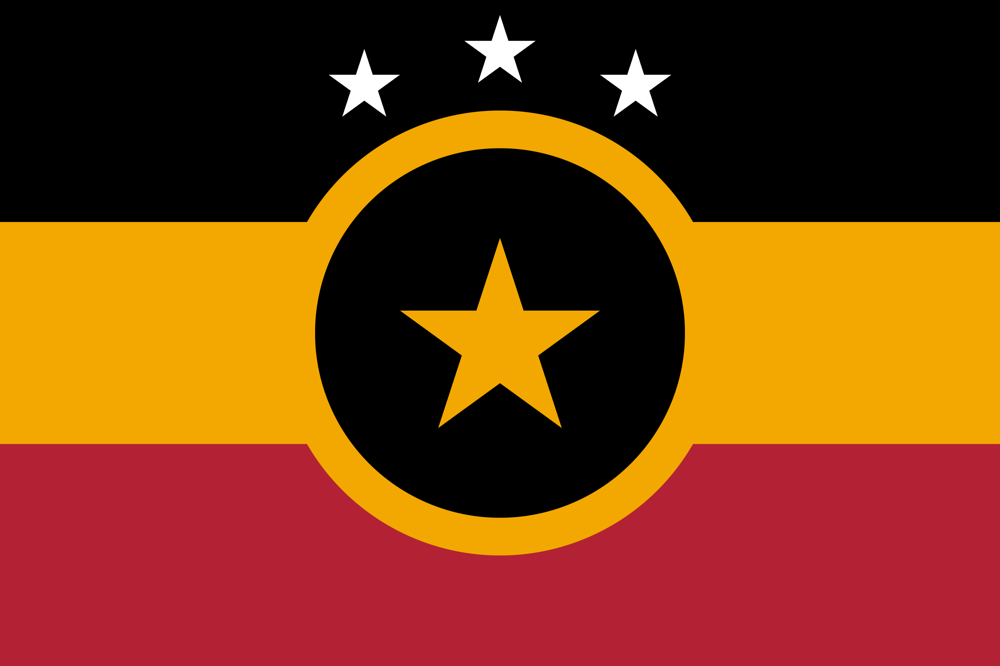
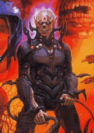

# Zol'Nos Empire
## Flag

Red represents the stained grounds of their homeworld Zol’Nozh and the vow of revenge against the galaxy. Yellow represents the accretion disk around the black hole. Black represents the unconquered space of the galaxy. The three stars at the top represent the Zol’Nos military venturing and conquering space. The central star represents the pride and culture of the Zol’Nos (and unknowingly represents the location of the Galactic Forge Portal).

## Info
The Zol'Nos are a warrior species, not the brightest species on average, but incredibly adaptive and cunning. They are lead by a single leader whose title is “Imperator Aeternus”. Their homeworld ([Zol'Nozh](../../Locations/zolnozh.md)) is barren, and scarred with a large crack embedded in the surface (think Mustafar but slightly more habitable). 

This species based their technology off of a [Curator](../Curators/curators.md) Ship stationed on the planet’s surface. The ship’s reactor is still operational, but its engines have long been rendered inoperable. The ship is used as the centre of Zol’Nos leadership and scientific endeavours.

## Style
### Features
Pointy, Spear-Like, Jagged

### Primary Colours
Silver, Orange, Black, hints of Desaturated Purple

## Reference Images

## History
The Zol’Nos originate from the planet Zol’Nozh, a beautiful, lush, jungle planet originally which orbited the central quasar of the smaller half of the galaxy (the planet orbited at a safe distance). The Zol’Nos were always xenophobic, but originally isolationist and afraid of the large unknown universe. One day the Zol’Nos encountered another spacefaring race known as the Klixxiak; a militant, xenophobic species. A brutal war ensued, both races bent on causing the others’ extinction. Eventually the Curators caught wind of this and intervened, demonstrating their power to the much younger races by ripping a planet in half and sternly demanded a cease to the conflict. The Klixxiak obliged, not wanting to be punished as they had heard of the Curators’ power through legend before. 

The Zol’Nos however, did not obey this order as they were overconfident. They launched a secret surprise attack against the Klixxiak, glassing their world, destroying every ship and causing the species’ extinction. The Curators noticed this, but it was too late, thus they sent harvester ships to the Zol’Nos system where all uninhabitable worlds were to be ground into dust to be used in the construction of the [Ark](../../Locations/ark.md) (this event is what prompted the construction of the Ark to preserve species). They also began building the entrance to the Central [Forge](../../Lore/Tech/the_forge.md) at the Quasar’s Event Horizon. The Zol’Nos could not tolerate this clear violation of their borders and declared war on the Curators, the latter sent a single Sovereign-Class Dreadnought to wipe the entire fleet of ~250 ships out.

One day the forge portal collapsed, destroying all Curator structures in the system and severely crippling Zol’Nozh, turning most of its surface into a harsh, barren, molten landscape. The Curators were never seen by the Zol’Nos again, but they vowed revenge for the damage to their homeworld and this story was passed down the generations until the present time.
