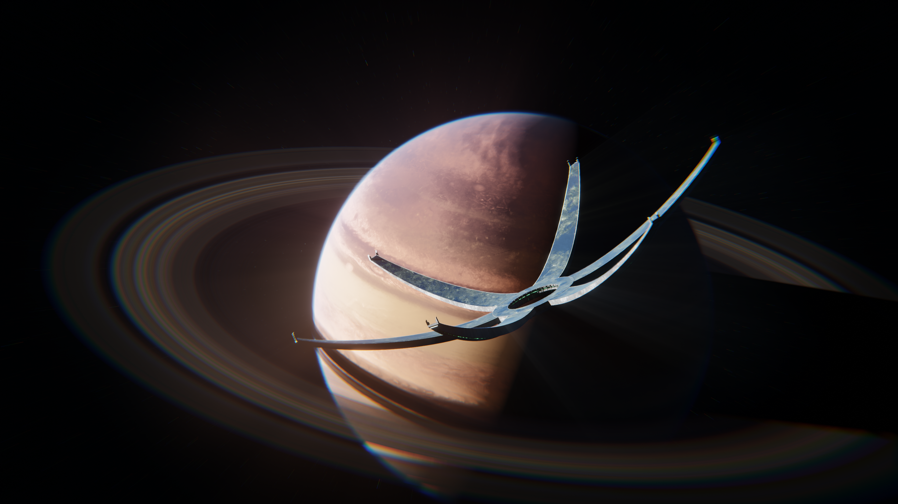
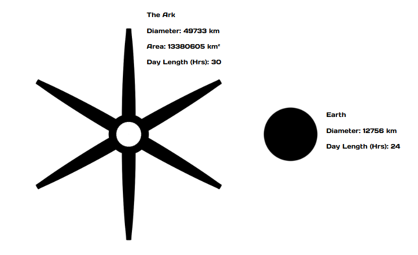

# The Ark

## Description
The Ark is a large megastructure composed of a central ring with 6 arms branching off, spanning approximately the length of Uranus. One side of the ark houses an adaptable biosphere which can be adjusted for the needs of the inhabiting species.

It was designed to preserve endangered sapient species whom the [Curators](../Factions/Curators/curators.md) would forcibly relocate onto the megastructure. Afterwards, they'd generally not intefere in that species affairs, aside from the occasional moral lecture.

In the centre of the ring lies the Citadel, a large superstructure; about the length of Ireland, acting as the control-centre of the Ark.

The Ark rotates clockwise on its X axis every 30 hours to provide a day/night cycle.

## Propulsion
The Ark is the largest object capable of [VEIL](../Lore/Tech/VEIL/veil.md) travel. Being able to achieve a max depth of VEIL-2. It should be noted that this requires immense power and the Ark will need time to recharge before it can enter VEIL again.

The ring segment houses 18 sublight torsion drives and 6 EBTs for VEIL.The Ark runs off of Vacuum Energy (the primary power source of the Curators), but also has 12 Large-Scale Quantum Reactors as a backup power source. 

## Construction
The Ark was constructed by the Curators in the [Zol'Nozh](../Locations/zolnozh.md) system through the destruction of many Zol'Nos claimed (but unsettled) worlds. This partially a punishment against the Zol'Nos for their disobedience and genocide of the Klixxiak race, but also to ensure that said genocide could never happen again.

## Cyroni Settlement
The [Cyroni](../Factions/Cyronia/cyroni.md) were the first and only sapient species to be hosted on the Ark. Samples of flora and fauna of Cy’rie were transported to the Ark to avoid their extinction. Ever since the Cyroni achieved space travel, they have always been curious about the Citadel and have made many attempts over the centuries to enter it with little success as it is heavily secured.

At present, the Ark orbits a Jupiter-Sized gas giant in a highly elliptical polar orbit. 

## Size
