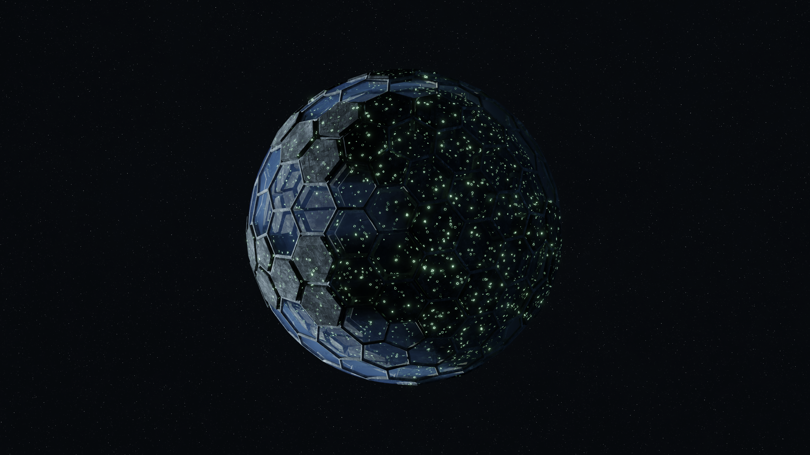
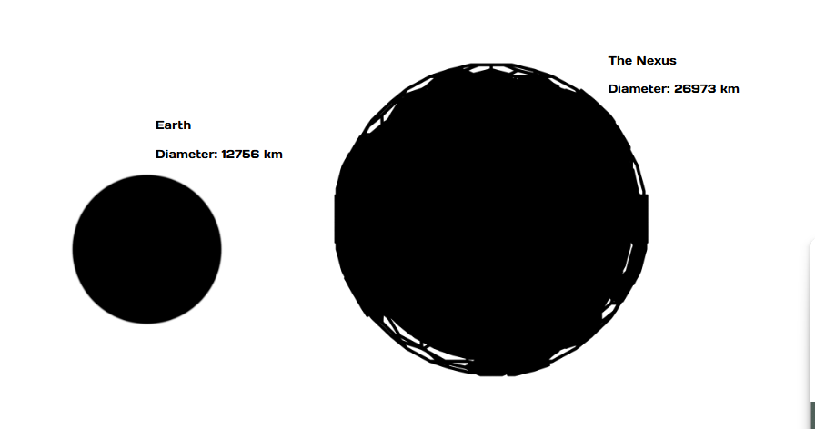

# The Nexus

## Description
The Nexus is the homeworld of the Niox which orbits a B Class Star. A formerly temperate world, now transformed into an Ecumenopolis. The world is constructed in hexagonal segments that form into a shell with air in between each shell. This image depicts the partial construction of Shell 3.

The centre of the planet features the most famous cultural forum of the species: The Nexus. A gathering where political and governmental decisions are made.

It is considered a rare privilege for a member of another species to set foot on this world, or to even be invited into the same system.

The industrial output of this world is unmatched by that of any other species.

## Size
