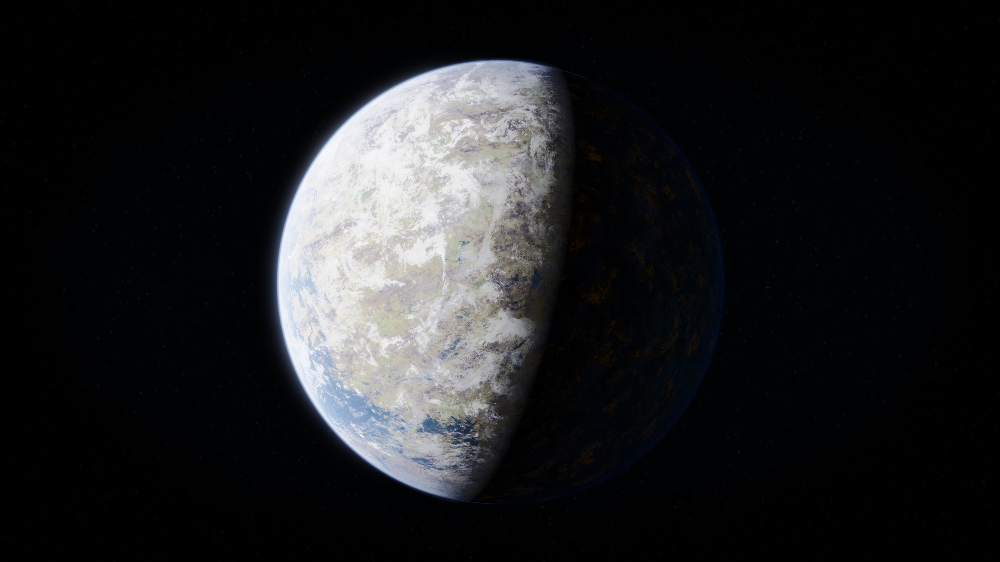
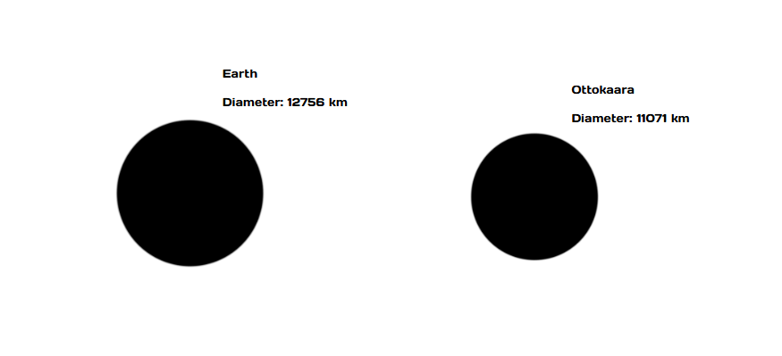

# Ottokaara

## Description
Ottokaara is a warm, earth-like planet. Its biosphere mostly comprising of savannah, grassland, desert and tropical forests. The planet is mostly land, being about 40% water.

## Size
