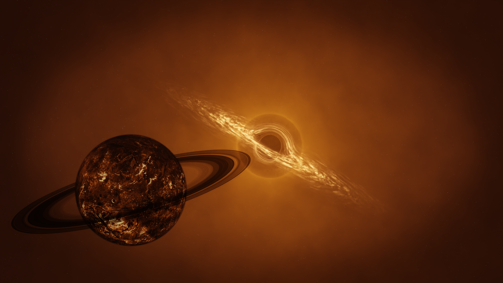
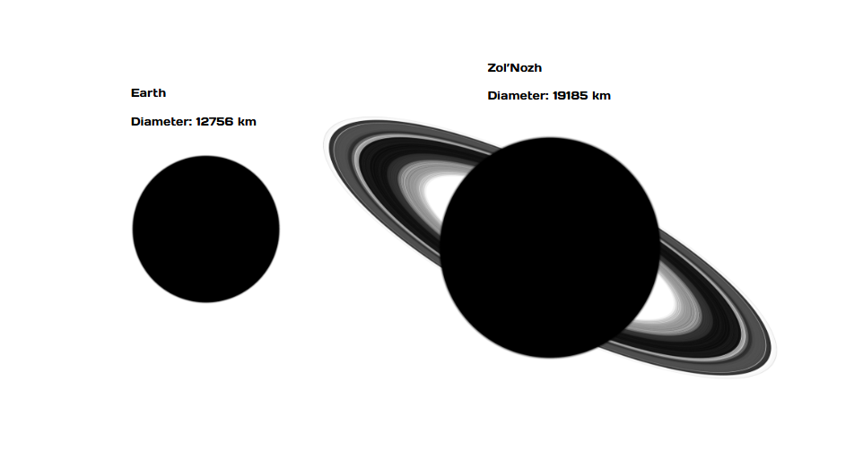

# Zol'Nozh

## Description
A once beautiful world, now scarred during the events of the [Great Destabilization](../Events/Galactic/great_destabilization.md). Zol'Nozh: The home of the Zol'Nos and their great empire. The world orbits the reknown quasar known as "Zol'Quos" which itself lies within a massive nebula, created from the Great Destabilization. The centre of the nebula has been cleaned out by the quasar over time, the nebula now essentially acting as a 'shell' for the system.

## The Quasar
Zol'Quos is a rare quasar. The Curators realized its potential and were determined to harness its power to manipulate matter. This objective lead to the creation of the Forge. A huge megastructure (essentially a massive portal) that could peer into the black hole. Unfortunately, the Curators made significant underestimations of the quasar and through the consistent preverbial 'poking the bear', the quasar reacted, causing the Great Destabilization and the presumed annihilation of the Curators.

## Size
