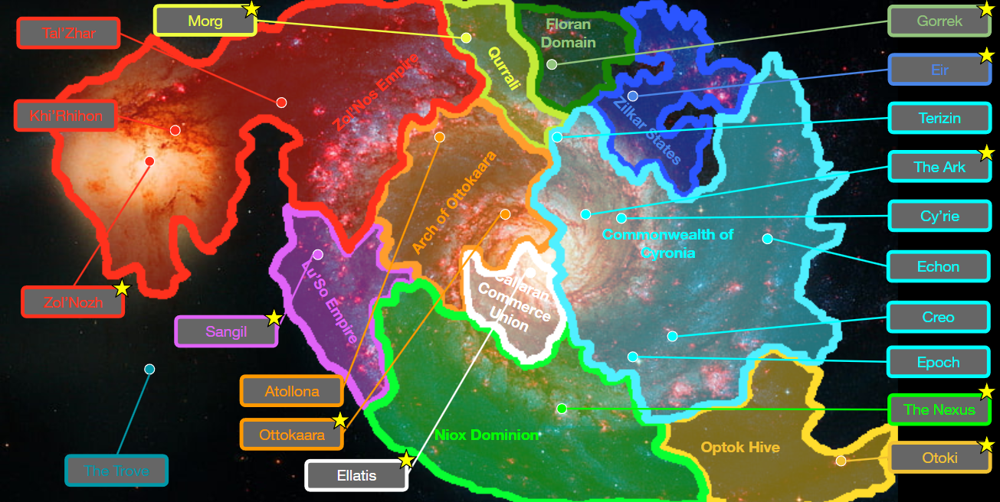
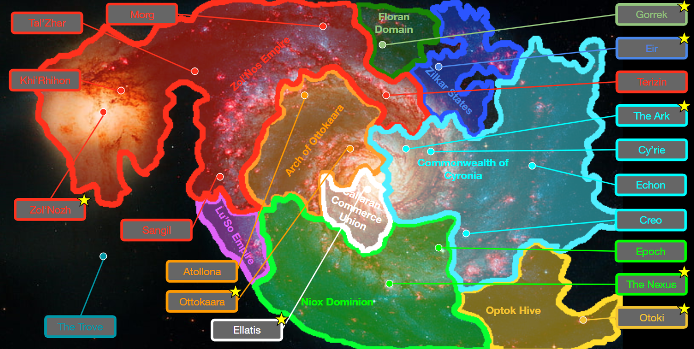
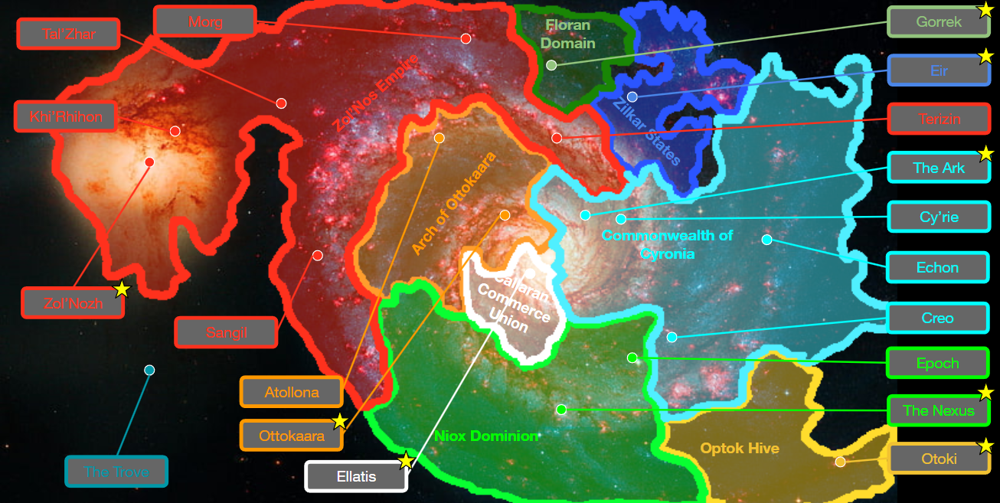
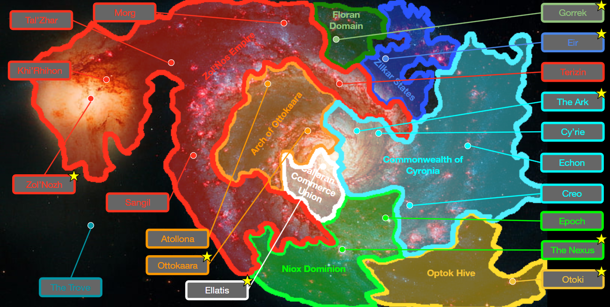
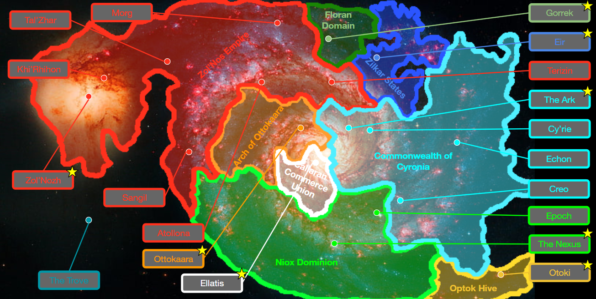
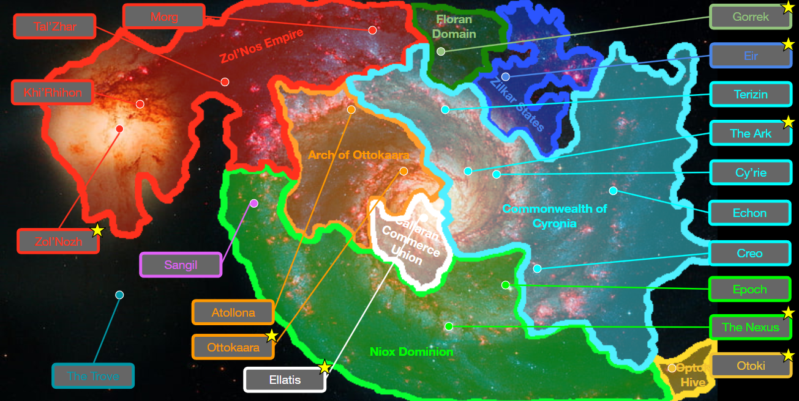
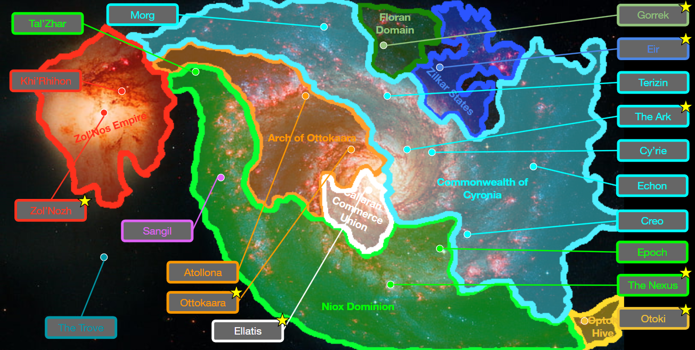
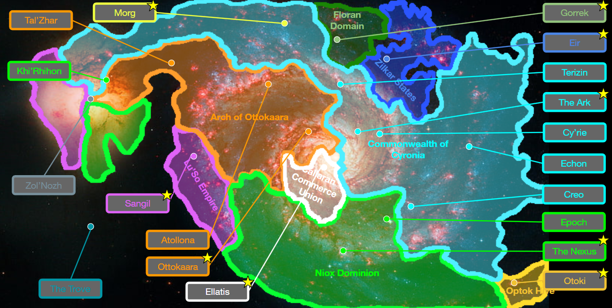

# Galactic War
## Prologue

The Zol’Nos Empire attacks Qurrali, capturing Morg swiftly. Qurrali falls within a month.

Amid disputes over Curator tech, the Niox and Cyroni go to war.
While the Niox win territory, the Cyroni manage to extract Curator technology out of the region, leading to no clear winner. The War ends in a stalemate after Niox forces stall into their advance into Cyroni space.

The Lu’So Empire and Ottokaara agree to war as a challenge of superiority, the Ottokaarans overpower the Lu’So attack due to their incredible defense strategy and push the Lu’So back, claiming victory.

## Part 1

The Calm Before the Storm.

## Part 2

After previous brief border skirmishes, Zol’Nos launches surprise attacks against Cyronia and the Lu’So, capturing Terizin and Sangil. 

The Lu’So lose their capital due to being overwhelmed by Zol’Nos numbers and superior tactics and are on the back foot.

## Part 3

The Zol’Nos advance on the Cyronia front stalls as they are met 
with fierce resistance. Colonies are laid under siege, while the front barely changes.

The Lu’So Empire surrenders to Zol’Nos, their population are demilitarized and forced into labour camps. 

Some Lu’So fleets are secretly hidden from the Zol’Nos.

## Part 4

Zol’Nos forms an alliance with the Optok, promising them half of Niox territory. While the Niox are strong, they are no match for the sheer numbers of Zol’Nos and Optok navies combined. 

The Zol’Nos launch a new front in Cyroni territory, attempting to cut the Ark off from outer-rim supply lines. 

## Part 5

The Cyroni commission their new naval ships to enter battle, allowing them to push the Zol’Nos back.

The Cyroni ally with the Niox, the combined effort and new technology crushes the Optok advance. 

The Niox also commission their newer naval ships and the front takes a turn for the worse for the Zol’Nos.

The Zol’Nos attack Ottokaara, seeking to take their large stores of resources to be used in ship construction. They glass 57 Ottokaaran worlds, leaving no survivors.

The first Zol’Nos planet-killer is deployed from Tal’Zhar, attempting to destroy Ottokaara.

## Part 6

The Zol’Nos Planet killer almost succeeds in destroying Ottokaara, but Cyronia intervenes and destroys the planet killer. This is a massive loss for the Zol’Nos.

Sangil is liberated by the Niox, the Lu’So reactivate their hidden fleets and rejoin the war effort.

Terizin is recaptured. The Cyroni set foot on Terizin for the first time since the start of the war.

For the first time in the war, the Zol’Nos are on the defensive on all fronts.

The Ottokaarans liberate captured territory, seeing the destruction of their worlds in person for the first time.

## Part 7

Tal’Zhar, the Zol’Nos’ secondary ship foundry is captured by a combined fleet of Ottokaarans, Cyroni, Lu’So and Niox.

The Emperor of the Zol’Nos declares ‘No Surrender’. 

## Post-War

In a huge calculated gamble, the Cyroni move the Ark to Zol’Nozh allowing entry into the [Forge](../../../Tech/the_forge.md). The Zol’Nos fight hard against the combined forces of the galaxy. The forge is ultimately destroyed.

Zol’Nozh falls and the Zol’Nos empire surrenders. Their territory is partitioned between the four main powers.

Zol’Nozh itself is partitioned into sectors.

Some rogue Zol’Nos Warlords still roam around the galaxy.

The Ark is moved back to its original position in Cyroni space.

Treaties are signed and borders finalized. The Niox restore former Lu’So territory, gaining an ally.
