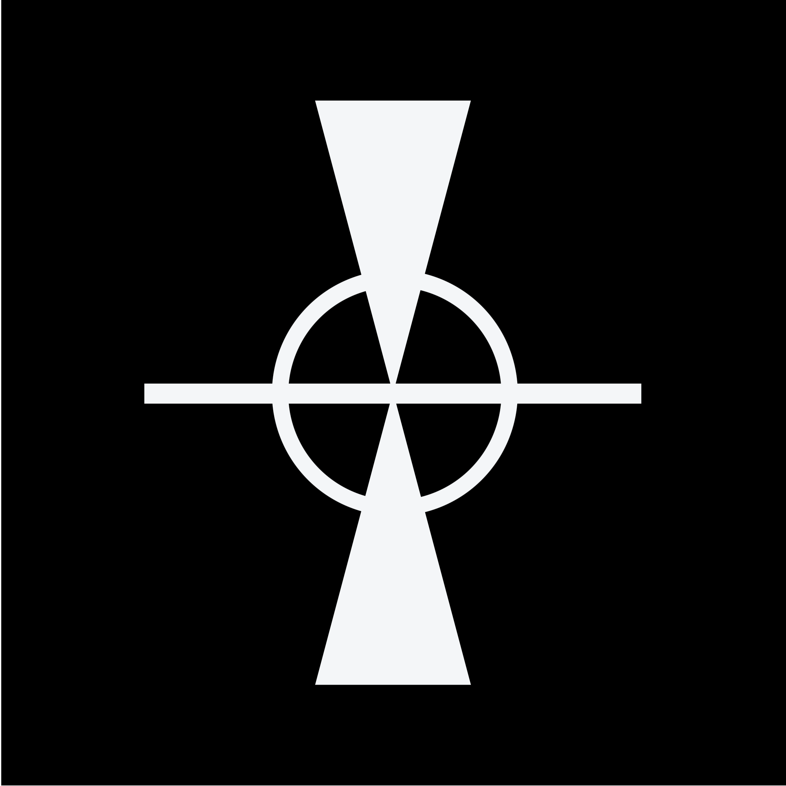
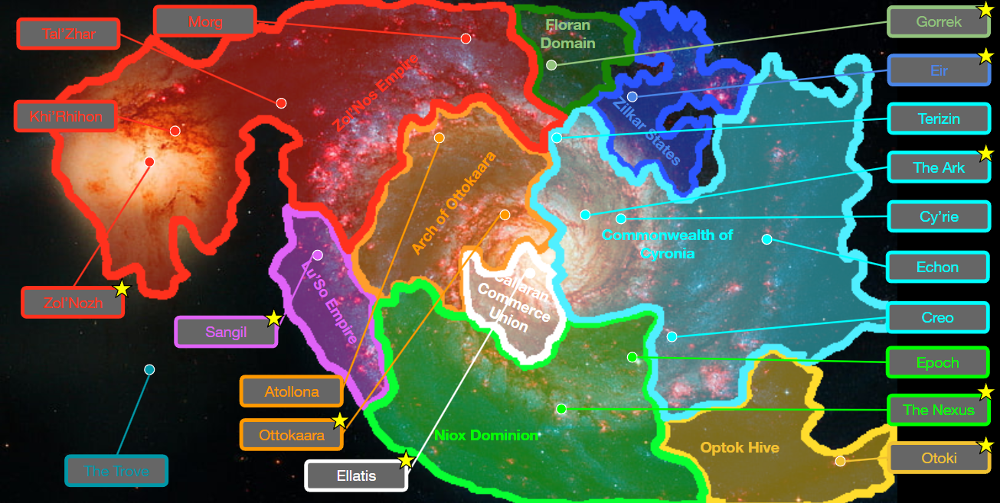

<h1 align='center'>Project Cyronia</h1>

Welcome to Project Cyronia, the rebirth of an old science fiction project started in 2017. This project aims to reconstruct the old AOAC project in a more concise and consistent form.

## The State of the Galaxy
Welcome to Gemelos; a galaxy with two galactic nuclei. Thousands of years ago, the galaxy was once ruled by the [Curators](Factions/Curators/curators.md), a hyper-advanced spare-faring race. All kinds of seemingly physics-defying technologies and megastructures were spread out throughout the galaxy. The Curators didn’t allow anyone else the privilege of using their technology, but would mostly allow lesser species to exist without interference. Above all, they prioritised the pursuit of science and discovery while also the safety and preservation of the lesser sapient races. There were only two conditions for the Curators directly interfering in the affairs of a species: 1) if they were in danger of extinction, or 2) if they were causing other species to be in danger of extinction.

One day, the Curators were ready to unveil their most sophisticated technology yet: The Forge. A massive megastructure, being able to harness the energy of the [Zol'Quos](Locations/zolnozh.md) quasar. It was capable of using Hard Light to manipulate matter to forge almost anything. Unfortunately the Megastructure malfunctioned, the reason for this is unknown. This rapidly destabilized the [VEIL](Lore/Tech/VEIL/veil.md), causing all permanent entrance portals linking to their settlements to collapse, locking the Curators away forever. Seemingly overnight, the most powerful species in the galaxy just disappeared. Thousands of years later, the sapient species that remain, race to claim the massive inheritance of the Curators.

## Map

## Contents
- Factions
    - [Callaran Commerce Union](./Factions/Callara/callaran.md)
    - [Curators](./Factions/Curators/curators.md)
    - Commonwealth of Cyronia
        - [Info](./Factions/Cyronia/cyroni.md)
        - [Navy](./Factions/Cyronia/navy.md)
    - [Floran Domain](./Factions/Florans/floran.md)
    - [Lu'So Empire](./Factions/LuSo/luso.md)
    - Niox Dominion
        - [Info](./Factions/Niox/niox.md)
        - [Navy](./Factions/Niox/navy.md)
    - [Optok Hive](./Factions/Optok/optok.md)
    - Arch of Ottokaara
        - [Info](./Factions/Ottokaara/ottokaara.md)
        - [Navy](./Factions/Ottokaara/navy.md)
    - [Unkindred](./Factions/Unkindred/unkindred.md)
    - [Zilkar States](./Factions/Zilkar/zilkar.md)
    - Zol'Nos Empire
        - [Info](./Factions/ZolNos/zolnos.md)
        - [Navy](./Factions/ZolNos/navy.md)
- Locations
    - [The Ark](./Locations/ark.md)
    - [The Nexus](./Locations/nexus.md)
    - [Ottokaara](./Locations/ottokaara.md)
    - [Zol'Nozh](./Locations/zolnozh.md)
- Lore
    - History
        - Events
            - Galactic
                - [The War of the Ancients](./Lore/History/Events/Galactic/ancient_war.md)
                - [Setting the Galactic Standard Year](./Lore/History/Events/Galactic/galactic_year.md)
                - [The Great Destabilization](./Lore/History/Events/Galactic/great_destabilization.md)
    - Tech
        - VEIL
            - [Communication (GCRN)](./Lore/Tech/VEIL/communication.md)
            - [Dead Zones](./Lore/Tech/VEIL/dead_zones.md)
            - [VEIL Dwellers](./Lore/Tech/VEIL/veil_dwellers.md)
            - [VEIL](./Lore/Tech/VEIL/veil.md)